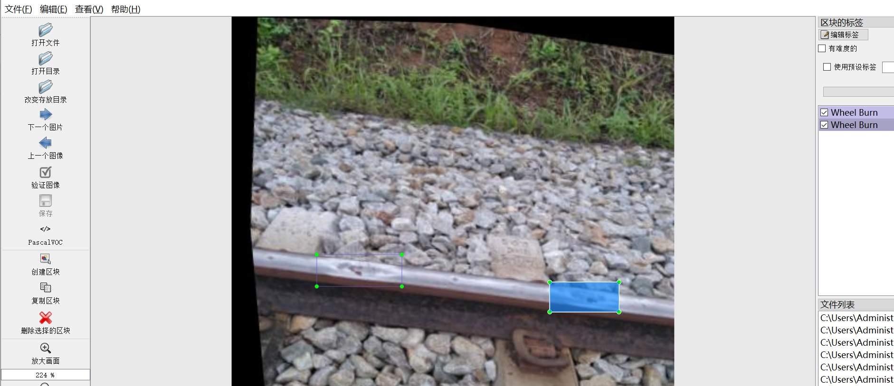
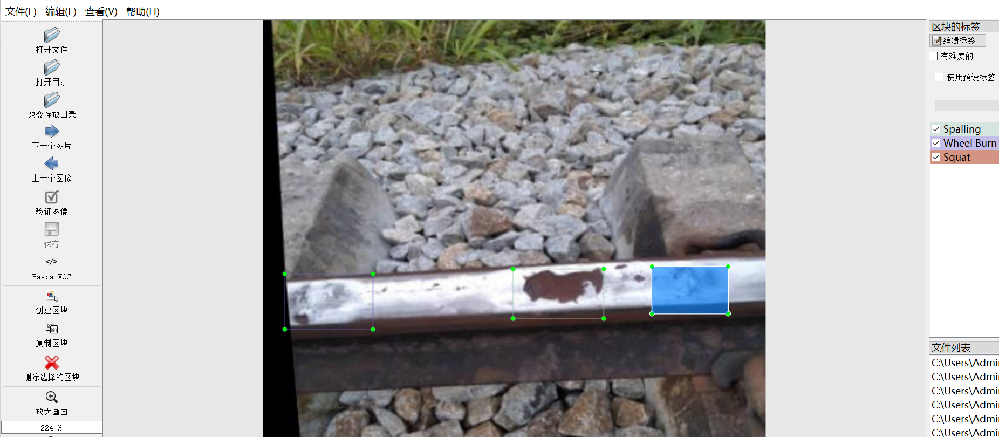
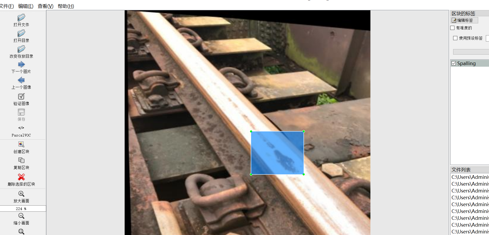

# [Object Detection] 4 typesRail Surface Defect Detection Dataset 4020 imagesYOLO+VOC format

Dataset Format: Pascal VOC + YOLO (excluding the split-path txt file; only jpg images with corresponding VOC-format xml files and YOLO-format txt files)

The compressed file contains: three folders, each storing images, xml files, and text files.

The total number of JPEG images in the JPEGImages folder is 4020.

The total number of XML files in the Annotations folder is 4020.

The total number of txt files in the labels folder is 4020.

Number of tag categories: 4

Tag Name: ["Corrugation", "Spalling", "Squat", "Wheel Burn"]

The number of boxes for each label (Note that the order of labels in the Yolo format does not correspond to this, but is based on the classes.txt file in the labels folder):

Corrugation Frame Number = 1452 (Wave Abrasions)

Spalling frame number = 2208 (peeling)

Squat frame count = 2949 (squat)

Wheel burn frame number = 546 (Rail track scuff)

Total frames count: 7155

Picture clarity (Resolution: Pixels): Clear

Image Enhancement: Yes

Shape of the label: Rectangular box, used for object detection and recognition.

Important Note: None

Special Notice: This dataset does not guarantee the accuracy or precision of the trained models or weight files. The dataset only provides accurate and reasonable annotations.
## Images

---

Here is a pay link on Stripe (https://buy.stripe.com/3cs8yP7sY87d0vu9AB). Please contact me lonlonago@foxmail.com after funding $89, and I will send you a complete data files, thank you!

